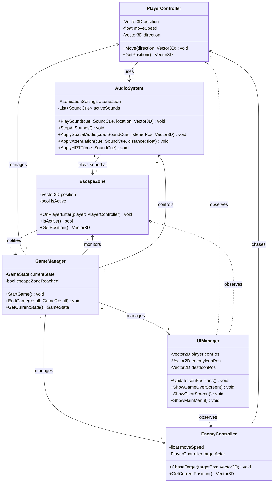
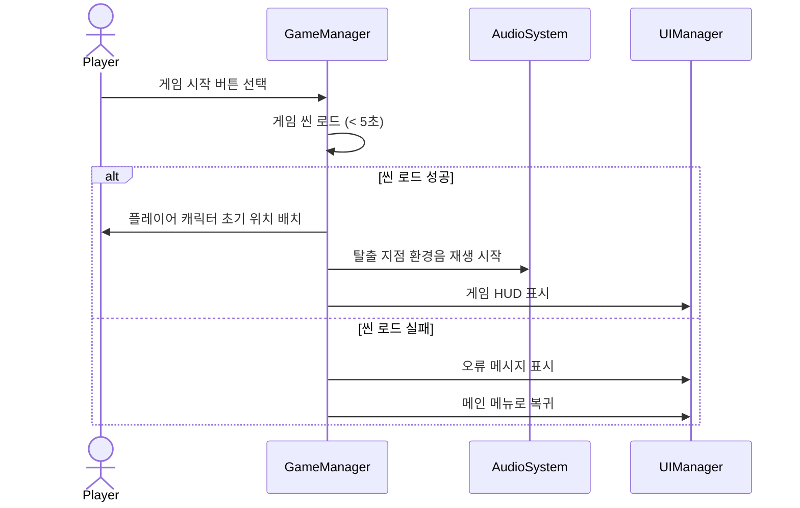
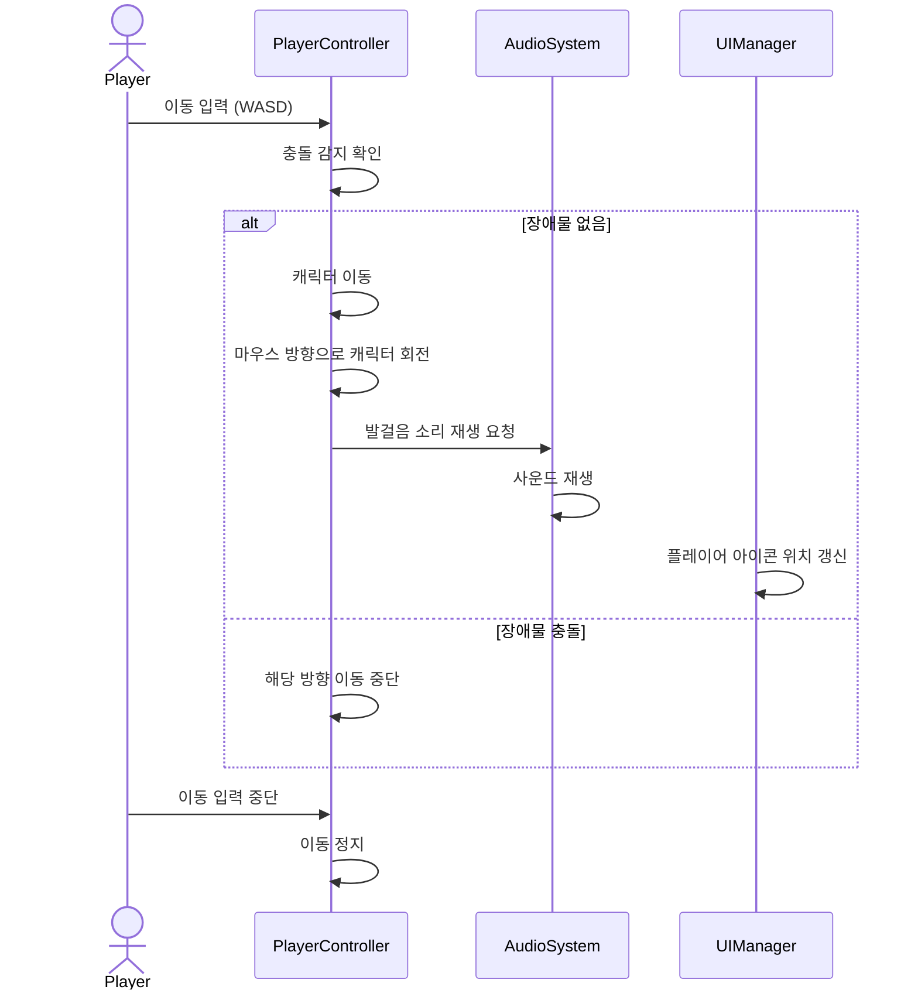
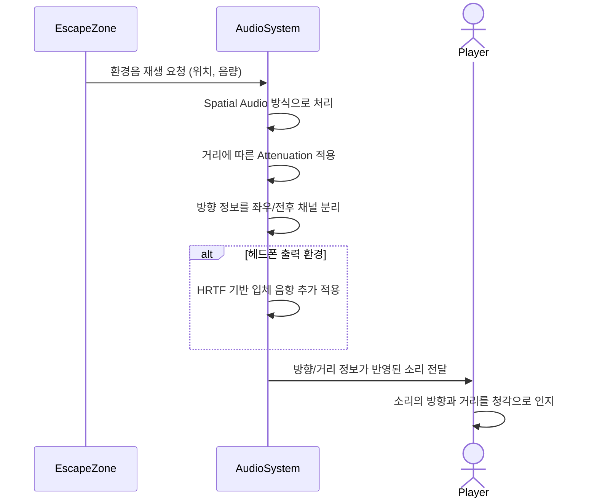
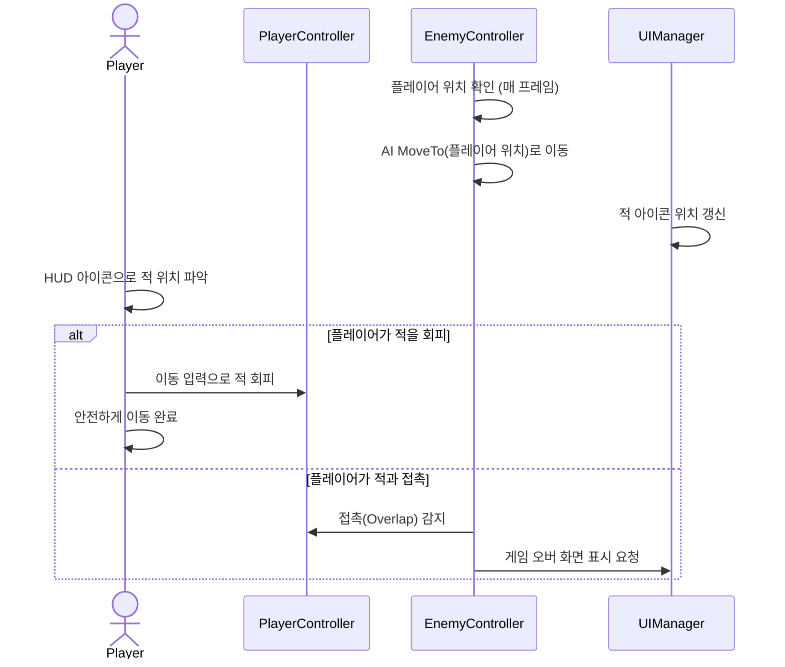
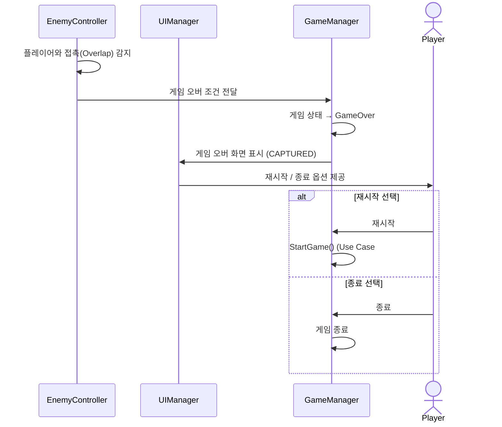
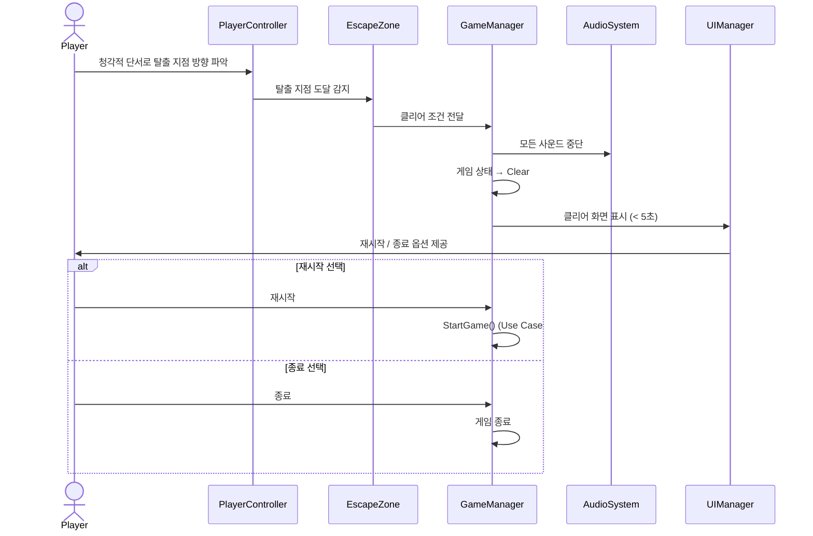
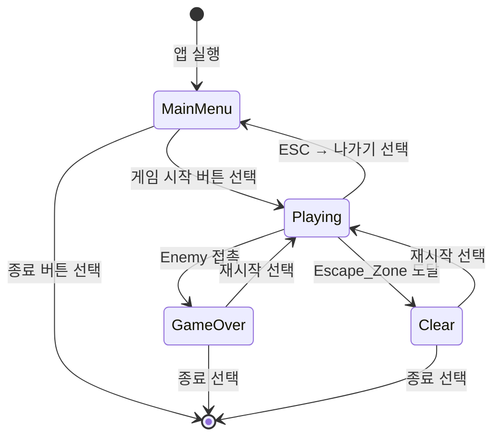
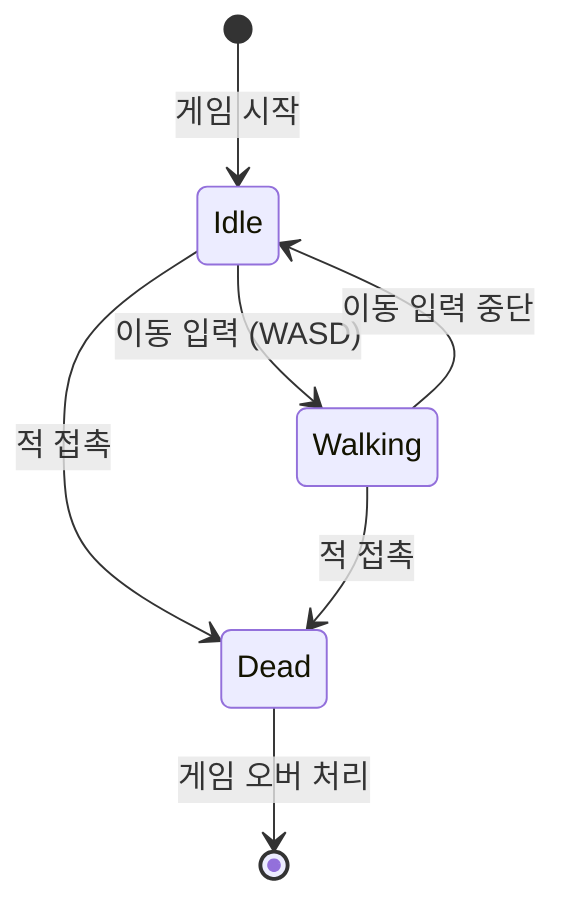
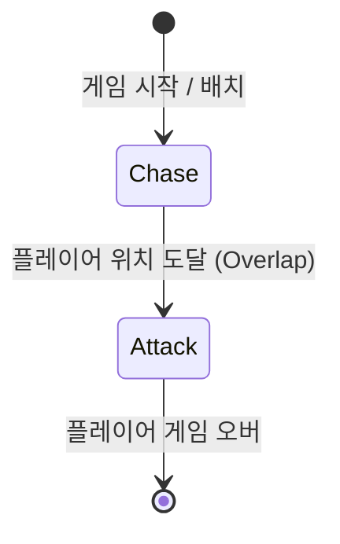

# Design

## Mystery Survival

**22112116, 강민호 (MinHo Kang), 22112116@yu.ac.kr**

---

## Revision History

| Revision date | Version # | Description | Author |
|---|---|---|---|
| 06/07/2026 | 1.00 | Initial design document | 강민호 |

---

## Contents

1. [Introduction](#1-introduction)
2. [Class Diagram](#2-class-diagram)
3. [Sequence Diagram](#3-sequence-diagram)
4. [State Machine Diagram](#4-state-machine-diagram)
5. [Implementation Requirements](#5-implementation-requirements)
6. [Glossary](#6-glossary)
7. [References](#7-references)

---

## 1. Introduction

본 문서는 언리얼 엔진 기반 청각 중심 공포 생존 게임 "Mystery Survival"의 설계 내용을 기술한다. Conceptualization 및 Analysis 단계에서 도출된 유스케이스와 도메인 분석 결과를 바탕으로, 시스템의 구조적·동적 설계를 다이어그램과 상세 설명을 통해 명확하게 제시한다.

**설계의 주요 포인트**는 다음과 같다.

첫째, 게임의 핵심 메커니즘인 청각 기반 인터랙션을 AudioSystem과 EscapeZone 클래스를 중심으로 설계하였다. Spatial Audio 처리와 Attenuation 적용을 AudioSystem이 전담하며, 탈출 지점에서 발생하는 환경음이 플레이어에게 방향 정보를 제공한다.

둘째, 적 AI의 추적 로직을 EnemyController가 담당하며, AI MoveTo를 이용하여 매 프레임 플레이어 위치를 목표로 이동한다. 플레이어와 접촉 시 즉시 게임 오버 조건이 발생한다.

셋째, GameManager가 게임 전체 흐름(메인 메뉴 → 플레이 → 게임 오버/클리어)을 제어하며, 각 서브시스템(AudioSystem, UIManager, EscapeZone)과의 인터랙션을 조율한다.

넷째, UIManager가 플레이어, 적, 탈출 지점의 월드 좌표를 화면 좌표로 변환하여 HUD 아이콘 위치를 매 프레임 갱신한다.

---

## 2. Class Diagram

### 2.1 Class Diagram

---

### 2.2 Class 상세 설명

#### PlayerController

| 항목 | 내용 |
|---|---|
| **역할** | 플레이어 캐릭터의 이동과 방향 전환을 담당한다. |
| **position** | 플레이어의 현재 3D 월드 좌표 |
| **moveSpeed** | 이동 속도 |
| **direction** | 현재 이동 방향 벡터 |
| **Move()** | WASD 입력에 따라 이동 처리. 발걸음 소리를 재생한다. |
| **GetPosition()** | 현재 위치를 반환한다. UIManager와 EnemyController가 참조한다. |

---

#### AudioSystem

| 항목 | 내용 |
|---|---|
| **역할** | 게임 내 모든 사운드 재생과 공간 음향 처리를 담당한다. |
| **attenuation** | 거리 감쇠 설정 정보 |
| **activeSounds** | 현재 재생 중인 Sound Cue 목록 |
| **PlaySound()** | 지정 위치에서 Sound Cue를 재생하고 Spatial Audio를 적용한다. |
| **StopAllSounds()** | 현재 재생 중인 모든 사운드를 중단한다. (게임 종료 시 호출) |
| **ApplySpatialAudio()** | 소리의 방향과 거리를 좌우/전후 채널로 분리하여 처리한다. |
| **ApplyAttenuation()** | 거리에 따라 음량을 감쇠 적용한다. |
| **ApplyHRTF()** | 헤드폰 출력 환경에서 HRTF 기반 입체 음향을 추가 적용한다. |

---

#### EnemyController

| 항목 | 내용 |
|---|---|
| **역할** | AI가 제어하는 적의 추적 행동을 담당한다. |
| **moveSpeed** | 적의 이동 속도 |
| **targetActor** | 추적 대상(플레이어) 참조 |
| **ChaseTarget()** | NavMesh를 이용해 플레이어 위치로 이동한다. 경로 탐색 실패 시 직선 이동을 시도한다. |
| **GetCurrentPosition()** | 현재 위치를 반환한다. UIManager가 아이콘 표시에 사용한다. |

---

#### GameManager

| 항목 | 내용 |
|---|---|
| **역할** | 게임 전체 흐름(시작, 진행, 종료)을 제어한다. |
| **currentState** | 현재 게임 상태 (MainMenu / Playing / GameOver / Clear) |
| **escapeZoneReached** | 탈출 지점 도달 여부 |
| **StartGame()** | 씬을 로드하고 각 서브시스템을 초기화한다. |
| **EndGame()** | 결과 화면을 표시한다. |

---

#### EscapeZone

| 항목 | 내용 |
|---|---|
| **역할** | 플레이어가 도달 시 클리어 조건을 GameManager에 전달하고, 공간 음향으로 위치를 알린다. |
| **position** | 탈출 지점의 월드 좌표 |
| **isActive** | 탈출 지점 활성화 여부 |
| **OnPlayerEnter()** | 플레이어 진입 감지 시 GameManager의 EndGame(Clear)를 호출한다. |

---

#### UIManager

| 항목 | 내용 |
|---|---|
| **역할** | 게임 내 모든 HUD 및 화면 UI를 관리한다. |
| **playerIconPos** | 화면에 표시되는 플레이어 아이콘의 현재 위치 |
| **enemyIconPos** | 화면에 표시되는 적 아이콘의 현재 위치 |
| **destIconPos** | 화면에 표시되는 목적지 아이콘의 현재 위치 |
| **UpdateIconPositions()** | 매 프레임 각 액터의 월드 좌표를 화면 좌표로 변환하여 아이콘 위치를 갱신한다. |
| **ShowGameOverScreen()** | 게임 오버 화면을 표시한다. |
| **ShowClearScreen()** | 클리어 화면을 표시한다. |
| **ShowMainMenu()** | 메인 메뉴 화면을 표시한다. |

---

## 3. Sequence Diagram

### 3.1 UC#1: 게임 시작

**설명**: 플레이어가 메인 메뉴에서 게임 시작 버튼을 누르면 GameManager가 씬을 로드하고 각 서브시스템(AudioSystem, UIManager)을 초기화한다. 씬 로드 실패 시 오류 메시지를 표시하고 메인 메뉴로 복귀한다.

---

### 3.2 UC#2 + UC#4: 환경 탐색 및 이동 조작

**설명**: 플레이어의 이동 입력에 따라 캐릭터가 이동하며, AudioSystem이 발걸음 소리를 재생한다. UIManager는 플레이어 아이콘 위치를 매 프레임 갱신한다. 마우스 커서 방향으로 캐릭터가 회전한다.

---

### 3.3 UC#3: 소리 감지

**설명**: 탈출 지점(EscapeZone)이 소리를 발생시키면 AudioSystem이 Spatial Audio와 Attenuation을 적용하여 플레이어에게 전달한다. 헤드폰 환경에서는 HRTF 기반 입체 음향이 추가 적용된다.

---

### 3.4 UC#5 + UC#6: 적 회피 및 적 반응

**설명**: 적은 매 프레임 AI MoveTo를 통해 플레이어를 추적한다. UIManager가 HUD에 적 아이콘 위치를 갱신하며, 플레이어는 이를 참고해 회피 경로를 결정한다. 플레이어와 접촉하면 즉시 게임 오버가 발생한다.

---

### 3.5 UC#7: 게임 오버

**설명**: 적이 플레이어와 접촉하면 GameManager에 게임 오버 조건이 전달되고, 즉시 게임 오버 화면(CAPTURED)이 표시된다. 플레이어는 재시작 또는 종료를 선택할 수 있다.

---

### 3.6 UC#8 + UC#9: 목표 달성 및 게임 종료

**설명**: 플레이어가 청각적 단서(환경음)를 통해 탈출 지점을 파악하고 도달하면 EscapeZone이 GameManager에 클리어 조건을 전달한다. GameManager는 모든 사운드를 중단하고 5초 이내에 클리어 화면을 표시한다.

---

## 4. State Machine Diagram

### 4.1 게임 전체 상태 머신

**설명**: 게임은 MainMenu, Playing, GameOver, Clear의 4가지 상태로 구성된다. 게임 시작 시 Playing 상태로 전환되며, 적과 접촉하면 GameOver, 탈출 지점에 도달하면 Clear 상태로 전환된다. 결과 화면에서 플레이어는 재시작 또는 종료를 선택할 수 있다.

---

### 4.2 플레이어 상태 머신

**설명**: 플레이어는 Idle(정지), Walking(걷기), Dead(사망)의 3가지 상태를 가진다. 이동 입력 여부에 따라 Idle/Walking 상태가 전환되며, 적과 접촉하면 Dead 상태로 전환된다.

---

### 4.3 적(Enemy) 상태 머신

**설명**: 적은 게임 시작과 동시에 Chase(추적) 상태로 진입하여 AI MoveTo를 통해 플레이어를 지속적으로 추적한다. 플레이어 위치에 도달하여 Overlap이 발생하면 Attack 상태로 전환되고 게임 오버가 발생한다.

---

## 5. Implementation Requirements

### 5.1 개발 환경

| 항목 | 내용 |
|---|---|
| **게임 엔진** | Unreal Engine 5.6 |
| **스크립팅** | Blueprint Visual Scripting |
| **오디오 시스템** | Unreal Engine Sound Cue + Resonance Audio Plugin |
| **AI 시스템** | Unreal Engine AI MoveTo + NavMesh |
| **버전 관리** | Git |

---

### 5.2 하드웨어 요구 사항

| 항목 | 최소 사양 | 권장 사양 |
|---|---|---|
| **OS** | Windows 10 64-bit | Windows 11 64-bit |
| **CPU** | Intel Core i5-8400 | Intel Core i7-12700 이상 |
| **RAM** | 8 GB | 16 GB 이상 |
| **GPU** | NVIDIA GTX 1060 6GB | NVIDIA RTX 3060 이상 |
| **저장 공간** | 10 GB 이상 | 20 GB 이상 (SSD 권장) |
| **오디오** | 스테레오 스피커 | 스테레오 헤드폰 (HRTF 활용) |

---

### 5.3 소프트웨어 요구 사항

| 항목 | 내용 |
|---|---|
| **Unreal Engine** | 5.6 |
| **Visual Studio** | 2022 이상 (C++ 빌드 환경) |
| **DirectX** | DirectX 12 이상 |
| **오디오 드라이버** | WASAPI 지원 드라이버 |

---

### 5.4 성능 요구 사항

| 항목 | 요구 사항 |
|---|---|
| **프레임 레이트** | 최소 30 FPS 이상 유지 |
| **입력 반응 시간** | < 50ms (이동, 소리 감지) |
| **게임 로드 시간** | < 5초 (씬 로드, 게임 종료 화면) |
| **AI 반응 시간** | < 100ms (적 추적 경로 갱신) |
| **사운드 지연** | < 50ms (Spatial Audio 처리) |

---

### 5.5 오디오 구현 요구 사항

| 항목 | 내용 |
|---|---|
| **Spatial Audio** | 언리얼 엔진 Attenuation Settings 및 Resonance Audio Plugin 활용 |
| **HRTF** | 헤드폰 환경에서 Head-Related Transfer Function 적용 |
| **Sound Cue** | 발걸음, 탈출 지점 환경음 등 개별 Sound Cue 구성 |
| **채널** | 모노(탈출 지점 환경음) — 스테레오 파일은 공간 음향 미지원 |

---

## 6. Glossary

| 용어 | 정의 |
|---|---|
| **Mystery Survival** | 본 프로젝트의 게임 명칭. 청각 기반 탑다운 공포 생존 게임. |
| **Player** | 게임을 조작하는 사용자 및 플레이어 캐릭터 |
| **Enemy / Enemy_AI** | 플레이어를 추적하는 적 AI 개체 |
| **PlayerController** | 플레이어의 이동, 방향 전환을 관리하는 클래스 |
| **AudioSystem** | 게임 내 사운드 재생과 공간 음향 처리를 담당하는 클래스 |
| **EnemyController** | 적 AI의 추적 행동을 담당하는 클래스 |
| **GameManager** | 게임 전체 흐름(시작/진행/종료)을 제어하는 클래스 |
| **EscapeZone** | 플레이어 도달 시 클리어 조건을 전달하는 탈출 지점 클래스 |
| **UIManager** | 플레이어/적/목적지 아이콘 HUD UI를 관리하는 클래스 |
| **Spatial Audio** | 소리의 방향과 거리를 입체적으로 표현하는 3D 오디오 기술 |
| **Attenuation** | 소리 발생 위치로부터 거리가 멀어질수록 음량이 감소하는 효과 |
| **HRTF** | Head-Related Transfer Function. 헤드폰 환경에서 소리의 3D 방향감을 구현하는 기술 |
| **Sound Cue** | 언리얼 엔진에서 여러 사운드를 조합하고 제어하는 오디오 구성 요소 |
| **Blueprint** | 언리얼 엔진의 노드 기반 시각적 스크립팅 시스템 |
| **NavMesh** | Navigation Mesh. 적 AI가 장애물을 우회하여 경로를 탐색하는 데 사용하는 탐색 가능 영역 메시 |
| **AI MoveTo** | 언리얼 엔진에서 AI가 지정된 목표 위치로 NavMesh 경로를 통해 이동하도록 하는 기능 |
| **Post Processing** | 렌더링된 화면에 밝기 조정 등의 시각 효과를 추가하는 처리 과정 |
| **GameState** | 게임의 전체 상태를 나타내는 열거형 (MainMenu / Playing / GameOver / Clear) |
| **HUD** | Heads-Up Display. 게임 화면에 오버레이로 표시되는 아이콘 등의 UI 요소 |

---

## 7. References

1. Epic Games. *Unreal Engine Documentation*. https://docs.unrealengine.com/
2. Epic Games. *Unreal Engine Audio System Overview*. https://docs.unrealengine.com/audio/
3. Freesound. *Audio Resources*. https://freesound.org/
4. INCOSE. *Systems Engineering Handbook*, 4th Edition.
5. Mavin, A. et al. "EARS: The Easy Approach to Requirements Syntax." *18th IEEE International Requirements Engineering Conference*, 2009.
6. Larman, C. *Applying UML and Patterns: An Introduction to Object-Oriented Analysis and Design and Iterative Development*, 3rd Edition. Prentice Hall, 2004.
